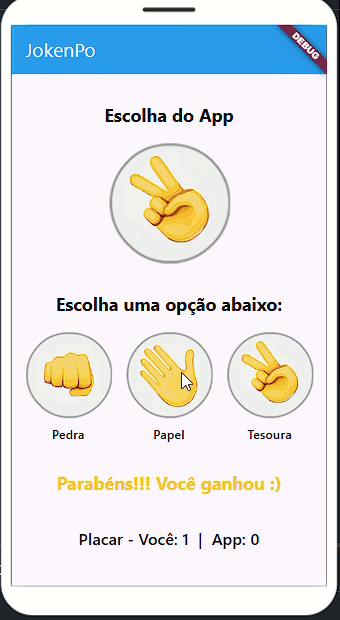

# Jokenpo

## 📌 Descrição
Este é um aplicativo de Jokenpô (Pedra, Papel e Tesoura) desenvolvido em Flutter. O usuário pode escolher entre pedra, papel ou tesoura e jogar contra a máquina, que faz uma escolha aleatória.

## 📸 Demonstração


## 🚀 Tecnologias Utilizadas
- Flutter
- Dart

## 📦 Instalação
1. Clone o repositório:
   ```bash
   git clone https://github.com/seu-usuario/seu-repositorio.git
   ```
2. Entre no diretório do projeto:
   ```bash
   cd seu-repositorio
   ```
3. Instale as dependências:
   ```bash
   flutter pub get
   ```
4. Execute o app:
   ```bash
   flutter run
   ```

## ✨ Como Jogar
1. Escolha entre Pedra, Papel ou Tesoura.
2. O aplicativo escolherá uma opção aleatória.
3. O resultado será exibido na tela!

## 📄 Licença
Este projeto está sob a licença MIT. Sinta-se livre para utilizá-lo e modificá-lo! 😊


# jokenpo

A new Flutter project created with FlutLab - https://flutlab.io

## Getting Started

A few resources to get you started if this is your first Flutter project:

- https://flutter.dev/docs/get-started/codelab
- https://flutter.dev/docs/cookbook

For help getting started with Flutter, view our
https://flutter.dev/docs, which offers tutorials,
samples, guidance on mobile development, and a full API reference.

## Getting Started: FlutLab - Flutter Online IDE

- How to use FlutLab? Please, view our https://flutlab.io/docs
- Join the discussion and conversation on https://flutlab.io/residents
